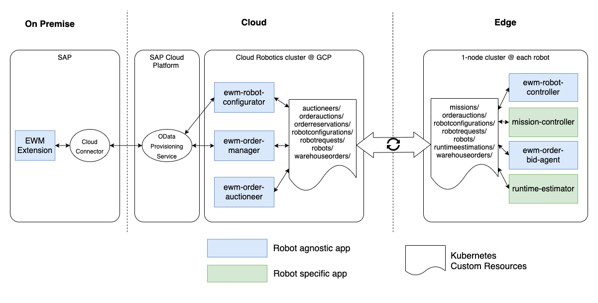
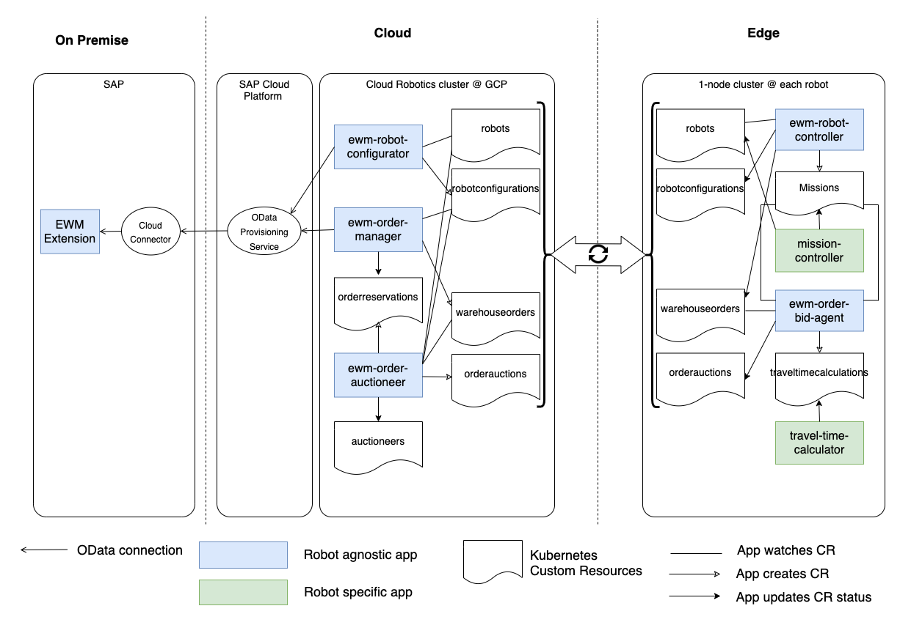

# Overview
SAP EWM Cloud Robotics is built on top of Google's open source [Cloud Robotics](https://github.com/googlecloudrobotics/core) infrastructure.

  

Our apps are using their [Federation Layer](https://googlecloudrobotics.github.io/core/concepts/federation.html) based Kubernetes [Custom Resources](https://kubernetes.io/docs/concepts/extend-kubernetes/api-extension/custom-resources/) for app to app communication including the distribution of SAP business objects to the robots.

Application management for all apps is done centrally from the Cloud using the [App Management Layer](https://googlecloudrobotics.github.io/core/concepts/app-management.html) of Cloud Robotics.

For interaction with SAP EWM Cloud Robotics is using OData interfaces. The _OData Provisioning Service_ in SAP Cloud Platform layer is optional to create an OData endpoint in the Internet. There are alternatives like exposing the SAP Gateway of the backend system itself to the Internet.

The architecture you see here is the target architecture for autonomous warehouse robots which are able to process their queue warehouse orders even when they lose connection to the network while doing so. This is possible because the _ewm-robot-controller_ which includes the business logic of how to process warehouse orders is running on the robot itself.

All applications meant to run on the edge Kubernetes cluster could easily be deployed in the cloud Kubernetes cluster too. But those robots are not completely independent from network outages anymore. It is possible to combine both options in one single installation. This could be useful in case you have different types of robots where some are supporting only one scenario and some the other.

# In detail

The EWM Cloud Robotics apps in general are stateless. Their state is stored either in Custom Resources or in the SAP EWM Backend. The _ewm-robot-controller_ app is an exception to that rule. It includes a state machine which inherits the business logic of how robots process warehouse orders. But even the state of this app can be restored at any time from Custom Resources.

These Custom Resources are used as interface between the apps and can be synchronized by the *Federation Layer* mentioned before. For a better understanding of this architecture it is important to keep in mind that a Custom Resources consist of **spec** and **status** (plus additional attributes like metadata etc.) as many other objects in the Kubernetes world too. Whenever you create a new Custom Resource, you define its *spec*. The *Federation Layer* is able to synchronize the *spec* from the Cloud to one or multiple robots and the *status* from robots to Cloud or the other way around. This is defined in the Custom Resource Definitions. Cloud and robots never write both to *spec* and *status* of the same Custom Resource Definition.

The definition of all our Custom Resources are available as [helm charts](https://github.com/SAP/ewm-cloud-robotics/tree/master/helm/charts/dependency-charts) in our repository.

  

## Warehouse order processing
The execution part of our solution describes the way how robots process warehouse orders. You find details about the process flow [here](process-flow.md#process-warehouse-orders-with-robots) Therefor, we use primarily _ewm-order-manager_ and _ewm-robot-controller_ apps on the process side and _mission-controller_ apps to send commands to robots. _robot-configurator_ app ensures that our robots are created and up-to-date in SAP EWM backend.

The most important custom resource in this context is the [Warehouse Order](https://github.com/SAP/ewm-cloud-robotics/blob/master/helm/charts/dependency-charts/ewm-crds/templates/warehouseorder.yaml). Its *spec* is created by _ewm-order-manager_ and synchronized with the robot which processes it. On the robot side _ewm-robot-controller_ processes the warehouse order and updates its *status* with the progress (warehouse task confirmations). *Status* is synchronized too whenever there is network connectivity, that _ewm-order-manager_ is able to send the confirmations to SAP EWM using our OData interface.

While processing the warehouse order _ewm-robot-controller_ creates multiple [Mission](https://github.com/SAP/ewm-cloud-robotics/blob/master/helm/charts/dependency-charts/mission-crd/templates/mission-crd.yaml) custom resources in order to move the robot to the right places. A _mission-controller_ is responsible to process these missions and update their status accordingly. _Mission-controllers_ are implemented robot specific. This means the Mission is our open interface specification to control warehouse robots.

The [Robot Configuration](https://github.com/SAP/ewm-cloud-robotics/blob/master/helm/charts/dependency-charts/ewm-crds/templates/robotconfiguration.yaml) custom resource contains the current configuration of each robot as well as its status. The configuration is maintained in the Cloud cluster using our EWM monitoring UI and synchronized to the robots, the *ewm-robot-controllers* update the *status*.

The whole process can run processing warehouse order in the sequence defined in SAP EWM backend without further optimization. In this case *ewm-robot-controller* of idle robots ask for work by creating a custom resource of type [Robot Request](https://github.com/SAP/ewm-cloud-robotics/blob/master/helm/charts/dependency-charts/ewm-crds/templates/robotrequest.yaml). This basic behavior can be enhanced with an optimization which follows the approach of an auction you find in the next chapter.

## Warehouse order auctions
Warehouse order auctions are a simple optimizing approach which works without knowledge about the specification (speed, acceleration, etc.) of the robots we are using. The only prerequisite is that participating robots are able estimate how long it takes getting from point A to point B. For further details about this process please check [this document](process-flow.md#optimize-warehouse-order-sequence-with-order-auctions).

This part of the process requires *ewm-order-manager*, *ewm-order-auctioneer* and *ewm-order-bid-agent* apps on the process site and a *runtime-estimator* app for communication with the robot.

The process is controlled by *ewm-order-auctioneer* which is configured in the [Auctioneer](https://github.com/SAP/ewm-cloud-robotics/blob/master/helm/charts/dependency-charts/order-auction-crds/templates/auctioneer.yaml) custom resource. The app watches several custom resource like warehouse orders, robot configurations, robots, order auctions and order reservations to identify when a new auction should be started and which robots should be able to bid. Whenever this is the case it starts requesting warehouse orders for the auction from *ewm-order-manager* by creating an [Order Reservation](https://github.com/SAP/ewm-cloud-robotics/blob/master/helm/charts/dependency-charts/order-auction-crds/templates/orderreservation.yaml) custom resource. When found *ewm-order-manager* reserves them in SAP EWM backend and adds them to the Order Reservation status.
Those warehouse ordered are attached to one [Order Auction](https://github.com/SAP/ewm-cloud-robotics/blob/master/helm/charts/dependency-charts/order-auction-crds/templates/orderauction.yaml) custom resource per robot by *ewm-order-auctioneer* and distributed to the robots.

On the robots *ewm-order-bid-agent* create bids for each warehouse order of the auction it is able to process and returns them in the status of the Order Auction. Therefor, it identifies the paths the robot needs to drive based on the current workload identified from warehouse order and mission custom resources and requests the run time for each path by creating a [Runtime Estimation](https://github.com/SAP/ewm-cloud-robotics/blob/master/helm/charts/dependency-charts/order-auction-crds/templates/runtimeestimation.yaml) custom resource. Runtime Estimations are our open interface for this process. They are processed by a robot specific *runtime-estimator* app.

Back in the cloud *ewm-order-auctioneer* collects the bids from status of all Order Auction custom resources and determines the winner robots of the auction. The winners are attached to the spec of the corresponding Order Reservation custom resource, that *ewm-order-manager* is able to assign them to the warehouse orders in SAP EWM backend.
Warehouse order processing process can now continue with an optimized sequence of warehouse orders.

## Integrating new robot models
It is relatively easy to integrate new robot models into our architecture. The only apps which have to be implemented robot specific are *mission-controller* and *runtime-estimator* apps mentioned in the previous chapters.

A *mission-controller* implements processing of [Mission](https://github.com/SAP/ewm-cloud-robotics/blob/master/helm/charts/dependency-charts/mission-crd/templates/mission-crd.yaml) custom resources and status update of the Robot custom resource you can find [here](https://github.com/googlecloudrobotics/core/blob/master/src/app_charts/base/cloud/registry-crd.yaml). For getting started please have a look at our implementation of [mir-mission-controller](https://github.com/SAP/ewm-cloud-robotics/tree/master/python-modules/mircontroller) in python.

The *runtime-estimator* implements processing of [Runtime Estimation](https://github.com/SAP/ewm-cloud-robotics/blob/master/helm/charts/dependency-charts/order-auction-crds/templates/runtimeestimation.yaml) custom resources. There is an existing implementation too. Check the [mir-runtime-estimator](https://github.com/SAP/ewm-cloud-robotics/tree/master/go/cmd/mir-runtime-estimator) written in Go. Additionally you finds a Go implementation of many data types we use in our [Go packages](https://github.com/SAP/ewm-cloud-robotics/tree/master/go/pkg).

# Have fun
🤖 