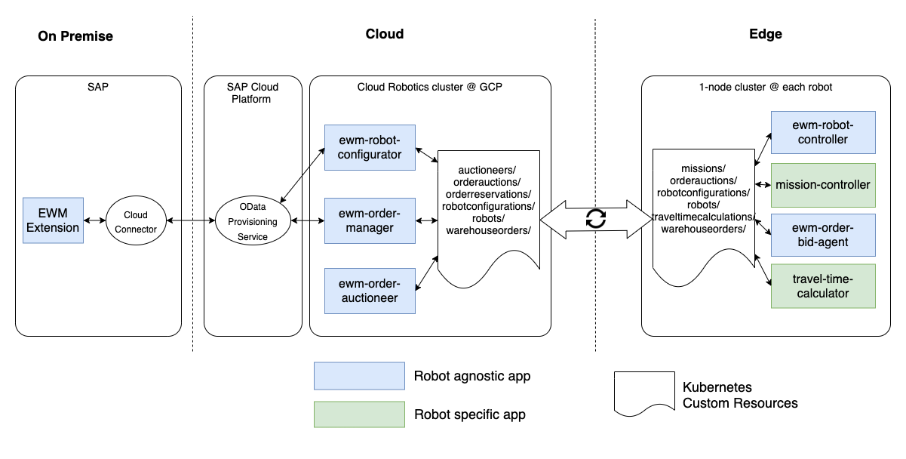

# Overview
SAP EWM Cloud Robotics is built on top of Google's open source [Cloud Robotics](https://github.com/googlecloudrobotics/core) infrastructure.

  

Our apps are using their [Federation Layer](https://googlecloudrobotics.github.io/core/concepts/federation.html) based Kubernetes [Custom Resources](https://kubernetes.io/docs/concepts/extend-kubernetes/api-extension/custom-resources/) for app to app communication including the distribution of SAP business objects to the robots.

Application management for all apps is done centrally from the Cloud using the [App Management Layer](https://googlecloudrobotics.github.io/core/concepts/app-management.html) of Cloud Robotics.

For interaction with SAP EWM Cloud Robotics is using OData interfaces. The _OData Provisioning Service_ in SAP Cloud Platform layer is optional to create an OData endpoint in the Internet. There are alternatives like exposing the SAP Gateway of the backend system itsself to the Internet.

# In detail

The EWM Cloud Robotics apps in general are stateless. Their state is stored either in Custom Resources or in the SAP EWM Backend. The _robot-controller_ app is an exception to that rule. It includes a state machine which inherits the business logic of how robots process warehouse orders. But even the state of this app can be restored at any time from Custom Resources.

  

## Apps for warehouse order processing
following soon

## Apps for warehouse order optimization
following soon

## Integrating new robot models
following soon