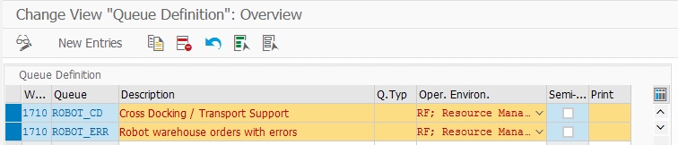
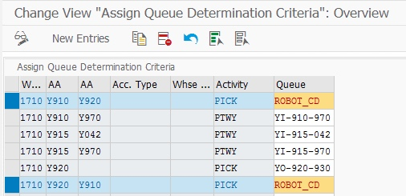
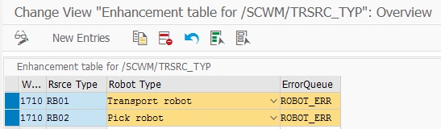
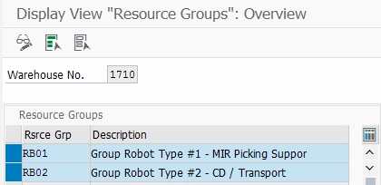
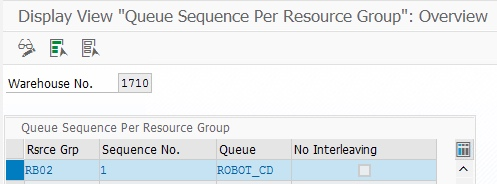
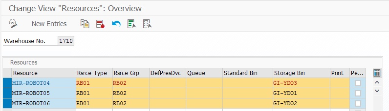

# Install SAP EWM extension
SAP EWM extension for Cloud Robotics includes all developments required to run Cloud Robotics enabled robots in an SAP EWM controlled warehouse. It consists of an OData interface, several robot specific master data and some process enhancements. It supports two different process types: 
1. The **Move Handling Unit** process meant for robots which are able to move a Handling Unit, such as mobile shelves, autonomously 
2. The **Pick, Pack and Pass** scenario designed for collaboration of human pickers and robots. In this scenario warehouse orders are assigned to a robot which is waiting for the picker at the source bins. The picker scans the robot to start the picking process.

All foundations and the **Move Handling Unit** process are part of this repository. The robot enabled **Pick, Pack and Pass** scenario can be found in a separate [repository](https://github.com/SAP/ewm-cloud-robotics-s4), because it includes some modifications of the system.
Both repositories can be deployed to a SAP system using [abapGit](https://github.com/abapGit/abapGit).

# Initial setup of SAP EWM system
After deployment of this repository's ABAP code there are some customzing and master data neccessary to get the processes running.
## Customizing
### Create Queues, Queue determination criteria for robots
Robots are treated as resources in SAP EWM. Thus, there should be dedicated robot _Queues_ with depend settings like _Queue determination criteria_ where warehouses order which should be processed by robots. There are two types of _Queues_:
- *Robot queue*: This is the queue to which robots should be assigned includes the warehouse orders for the robots
- *Error queue*: Robot warehouse orders where an error occured during processing are moved to this queue. It should be monitored by a warehouse operator. They could be assigned on a Resource Type level.

Example of queue defintion in customizing:

  

Example of queue determination in customizing:

  

### Create Resource Types for robots
There is a new attribute on _Resource Type_ level to classify a resource either as transport or as picking robot. As of now only transport robots are supported.
The attribute _Robot Type_ and the _Error Queue_ for this resource type are maintained in table view *ZEWM_TRSRC_TYP*

Example of enhancement table *ZEWM_TRSRC_TYP* for resource types in transaction SM30:

  

## Master Data
## Create Resource Groups for robots
Create _Resource Groups_ for your robots using transaction _/SCWM/RGRP_

  

## Maintain queue sequence for robot's Resource Group
The _Queue Sequence_ for the resource group is maintained in transaction _/SCWM/QSEQ_

  

## Create Resource for robot
Resources for robots are created automatically by Cloud Robotics once they are active for the first time. But you can create and edit them too in transaction _/SCWM/RSRC_

  

